# Red Hat Observability Demo

Easily observe your cluster and its workloads within the OpenShift Console and
your external tooling.

<!-- vim-markdown-toc GFM -->

* [Three Key Points](#three-key-points)
* [Architecture](#architecture)
    * [Metrics](#metrics)
    * [Logs](#logs)
    * [Traces](#traces)
* [Setting Up](#setting-up)
    * [What You'll Need](#what-youll-need)
    * [Instructions](#instructions)
        * [Create AWS Resources](#create-aws-resources)
        * [Install the OpenShift GitOps operator](#install-the-openshift-gitops-operator)
        * [Create secrets](#create-secrets)
        * [Create GitOps Applications](#create-gitops-applications)
            * [Demo Operators](#demo-operators)
            * [Demo Resources](#demo-resources)
            * [Sample Applications](#sample-applications)
* [Demo](#demo)
    * [Step Zero Monitoring with OpenShift Monitoring](#step-zero-monitoring-with-openshift-monitoring)
    * [Zooming in with Signal Correlation and the Cluster Logging Operator](#zooming-in-with-signal-correlation-and-the-cluster-logging-operator)
    * [Analyzing application behavior with OpenShift Tracing and OpenTelemetry](#analyzing-application-behavior-with-openshift-tracing-and-opentelemetry)
    * [Export into existing observability platforms](#export-into-existing-observability-platforms)
    * [Next Steps](#next-steps)

<!-- vim-markdown-toc -->
## Three Key Points

- Observe cluster and workload behavior with minimal configuration with the
  **Red Hat Cluster Observability Operator (COO)**
- Aggregate and forward logs to your corporate log aggregators or SIEMs with the
  **Red Hat Cluster Logging Operator (CLO)**
- Send workload and cluster signals to your existing observability stack with
  the **Red Hat Build of OpenTelemetry**

## Architecture

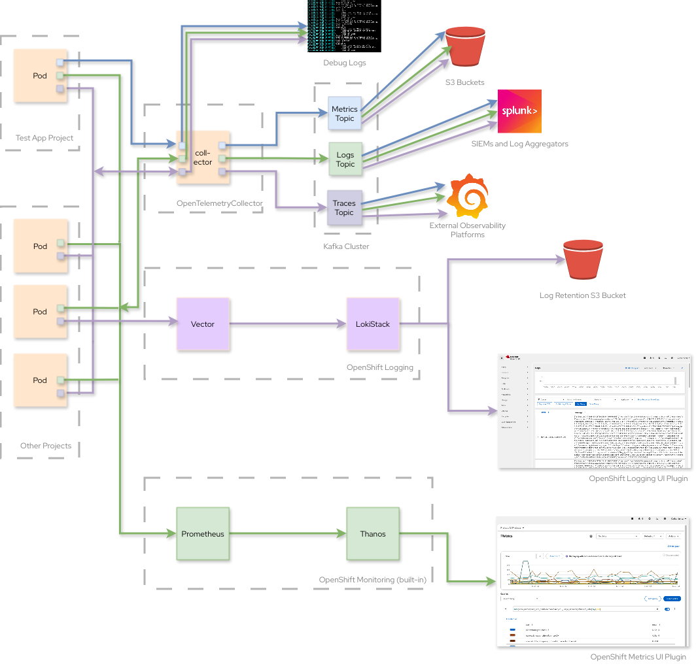

The resources provided in this demo create an end-to-end observability stack for
metrics, logs and traces on any OpenShift cluster.

### Metrics

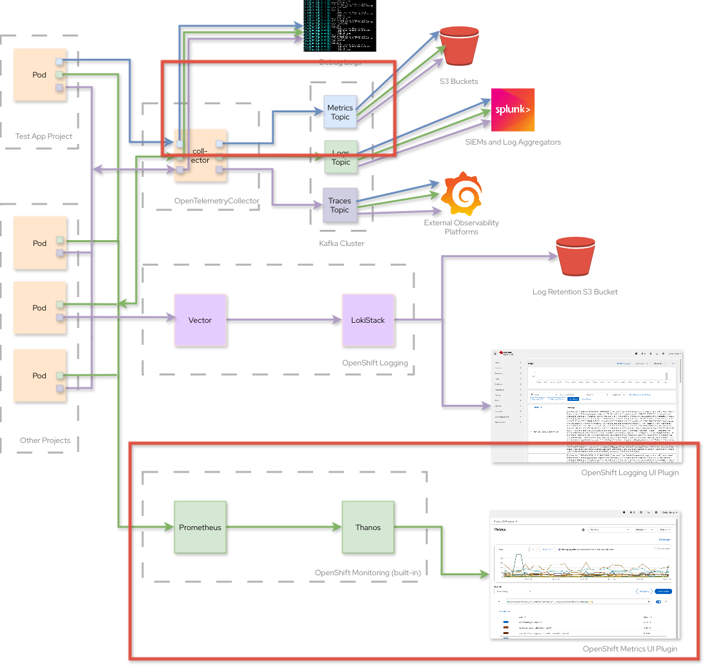

Metrics are captured for all workloads in the cluster and the OpenShift control
plane and worker nodes that host them. They are surfaced in two ways: by a
Prometheus instance managed by the built-in OpenShift Monitoring operator, and
by an OpenTelemetry collector managed by the operator for the Red Hat Build of
OpenTelemetry. The collector forwards metrics to a Kafka topic and to Perses for
external visualization.

This implementation makes it possible for cluster operators to quickly observe
cluster health in the **Observe** > **Metrics** pane within the OpenShift
Console, and for other engineers to query and dashboard the signals they care
about from a central observability platform, like Datadog, Grafana or Perses.

### Logs

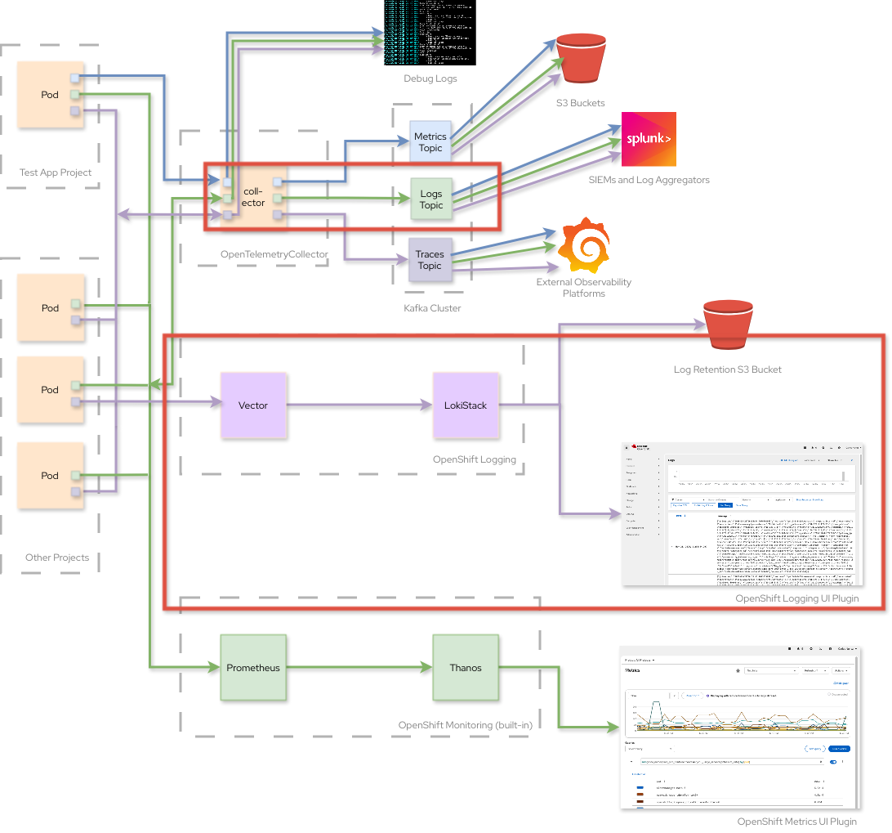

Like our metrics architecture, workload and cluster node logs are aggregated in
two ways: by a Vector instance managed by the **Cluster Logging Operator**
through a `ClusterLogForwarder` resource, and by the same OpenTelemetry
collector that collects metrics, as described in the previous section. The
OpenTelemetry collector forwards log entries to a Kafka tapic and to Perses.

Unlike the metrics design, the redundancy implemented here is only for
demonstration purposes. We recommend choosing only one of these options to
reduce CPU and network pressure on your cluster.

The **Red Hat Build of OpenTelemetry** is a good choice for those seeking to
centralize signal aggregation and forwarding, whereas the **Cluster Logging
Operator** is ideal for those who desire having dedicated collectors for
metrics, logs and traces.

### Traces

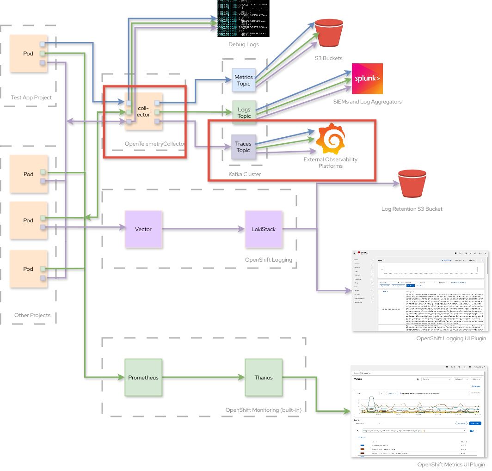

Traces are collected by OpenTelemetry and forwarded to a Tempo instance managed
by the **Cluster Observability Operator (COO)** and to Kafka as well as Perses.

Like metrics, Tempo and the OpenShift Console UI Plugin provided by COO provide
cluster operators with a quick glance at application behavior in the **Observe** > 
**Traces** pane.

This demo also provides an AI-generated Golang web server to show how tracing works
within OpenShift. Spans are generated by a human-generated script performing
random HTTP methods against the web server every second.

## Setting Up

### What You'll Need

- An AWS Account with an Access and Secret Key Pair
- The AWS CLI
- An OpenShift Cluster (tested with v4.20)
- Access to a shell, like `bash`, `zsh` or `fish`

> 📝 **NOTE**
>
> You have several options if you don't have an OpenShift cluster handy:
>
> - [OpenShift Local](https://developers.redhat.com/products/openshift-local) or
> - Stand up a Single-Node OpenShift cluster in about 45 minutes
>   with [Carlos's Demoland](https://github.com/redhat-na-ssa/demo-cluster-observability-rhobs).

### Instructions

> 📝 **NOTE**
>
> A complete guide for deploying the environment manually can be
> found [here](./include/docs/workshops/observability-on-openshift/1-setting-up.md).

#### Create AWS Resources

Run the CloudFormation script supplied this with this demo:

```sh
aws cloudformation create-stack \
  --capabilities CAPABILITY_NAMED_IAM \
  --stack-name rhobs-s3-demo \
  --template-body file:///./include/cloudformation/loki_s3_bucket.yaml 
```

This will:

- Create a bucket that Loki and Tempo will store logs and traces into,
  respectively, and
- Create an IAM user that is only allowed to read from and write into this
  bucket.

Run `aws cloudformation describe-stacks --stack-name rhobs-s3-demo` and wait for
it to achieve a `CREATE_COMPLETE` state.

Once it does, run the command below to get the name of the bucket and the user's
access and secret key pair:

```sh
data=$(aws cloudformation describe-stack-events --stack-name rhobs-s3-demo \
  --query 'Stacks[0].Outputs' \
  --output text)
bucket_name=$(echo "$data" | grep -E '^BucketName' | awk '{print $NF}')
ak=$(echo "$data" | grep -E '^AccessKey' | awk '{print $NF}')
sk=$(echo "$data" | grep -E '^SecretAccessKey' | awk '{print $NF}')
```

#### Install the OpenShift GitOps operator

Install the OpenShift GitOps operator from the **Ecosystem > Software Catalog** pane
using the defaults.

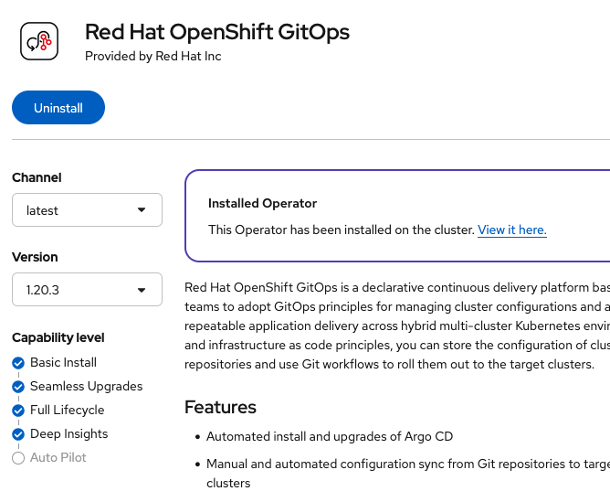
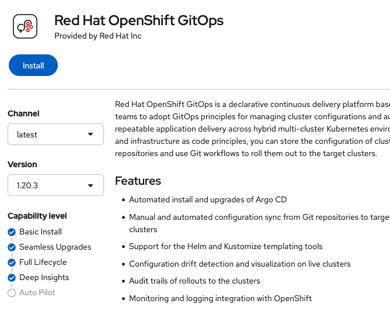

Once the installation is complete, run the commands below to create an
application that installs the operators and components used by this demo:

#### Create secrets

```sh
region=$(aws configure get region)
cat >/tmp/kustomization.yaml <<-EOF
resources:
- ../components/openshift-tracing/resources/tempo-stack/secret/s3
- ../components/openshift-logging/resources/loki-stack/secret/s3
patches:
  - target:
      kind: Secret
      name: tempostack-s3
      namespace: openshift-tracing
    patch: |-
      - op: replace
        path: /metadata/name
        value: rhobs-secret-s3
      - op: replace
        path: /metadata/namespace
        value: openshift-observability
      - op: replace
        path: /stringData/bucket
        value: rhobs-demo-bucket
      - op: replace
        path: /stringData/endpoint
        value: https://s3.$region.amazonaws.com
      - op: replace
        path: /stringData/access_key_id
        value: "$ak"
      - op: replace
        path: /stringData/access_key_secret
        value: "$sk"
  - target:
      kind: Secret
      name: logging-loki-s3
      namespace: openshift-logging
    patch: |-
      - op: replace
        path: /metadata/namespace
        value: openshift-logging
      - op: replace
        path: /stringData/bucketnames
        value: "$bucket_name"
      - op: replace
        path: /stringData/endpoint
        value: https://s3.$region.amazonaws.com
      - op: replace
        path: /stringData/access_key_id
        value: "$ak"
      - op: replace
        path: /stringData/access_key_secret
        value: "$sk"
EOF
oc apply -k /tmp
rm -r /tmp/kustomization.yaml
```

#### Create GitOps Applications

Next you'll create three GitOps Applications that will sync the demo resources in this
codebase with your cluster.

##### Demo Operators

```sh
# Remember to run `oc login` first before running the command(s) below
cat <<-EOF | oc apply -f -
apiVersion: argoproj.io/v1alpha1
kind: Application
metadata:
  name: rhobs-demo-operators
  namespace: openshift-gitops
spec:
  project: default
  destination:
    namespace: openshift-gitops
    server: https://kubernetes.default.svc
  source:
    repoURL: https://github.com/redhat-na-ssa/demo-cluster-observability-rhobs
    targetRevision: main
    path: ./gitops/operators
  syncPolicy:
    automated:
      enabled: true
    syncOptions:
      - SkipDryRunOnMissingResources=true
EOF
```

##### Demo Resources

```sh
# Remember to run `oc login` first before running the command(s) below
cat <<-EOF | oc apply -f -
apiVersion: argoproj.io/v1alpha1
kind: Application
metadata:
  name: rhobs-demo-resources
  namespace: openshift-gitops
spec:
  project: default
  destination:
    namespace: openshift-gitops
    server: https://kubernetes.default.svc
  source:
    repoURL: https://github.com/redhat-na-ssa/demo-cluster-observability-rhobs
    targetRevision: main
    path: ./gitops/resources
  syncPolicy:
    automated:
      enabled: true
    syncOptions:
      - SkipDryRunOnMissingResources=true
EOF
```

##### Sample Applications

```sh
# Remember to run `oc login` first before running the command(s) below
cat <<-EOF | oc apply -f -
apiVersion: argoproj.io/v1alpha1
kind: Application
metadata:
  name: rhobs-demo-apps
  namespace: openshift-gitops
spec:
  project: default
  destination:
    namespace: openshift-gitops
    server: https://kubernetes.default.svc
  source:
    repoURL: https://github.com/redhat-na-ssa/demo-cluster-observability-rhobs
    targetRevision: main
    path: ./gitops/apps
  syncPolicy:
    automated:
      enabled: true
    syncOptions:
      - SkipDryRunOnMissingResources=true
EOF
```

The environment will be ready in about 15 minutes.


## Demo

You are a platform operator that is responsible for administrating the
container platform for your engineering organization. Your company has lots of
observability tools --- monitoring platforms, log aggregators, the Syslog server
"over there somewhere" --- but you probably start your day in a Kubernetes
console of some kind.

Let's see what the observability flow with OpenShift looks like for a single
cluster in this demo.


<!-- vim-markdown-toc GFM -->

* [Step Zero Monitoring with OpenShift Monitoring](#step-zero-monitoring-with-openshift-monitoring)
* [Zooming in with Signal Correlation and the Cluster Logging Operator](#zooming-in-with-signal-correlation-and-the-cluster-logging-operator)
* [Analyzing application behavior with OpenShift Tracing and OpenTelemetry](#analyzing-application-behavior-with-openshift-tracing-and-opentelemetry)
* [Export into existing observability platforms](#export-into-existing-observability-platforms)
* [Next Steps](#next-steps)

<!-- vim-markdown-toc -->

### Step Zero Monitoring with OpenShift Monitoring

Platform operators can quickly see how their clusters are doing by navigating to
the OpenShift Console and clicking on **Observe**, then **Metrics**.

After selecting any of the built-in queries, like _CPU Usage_, the Console
provides the traditional line graph you'd expect to see here.

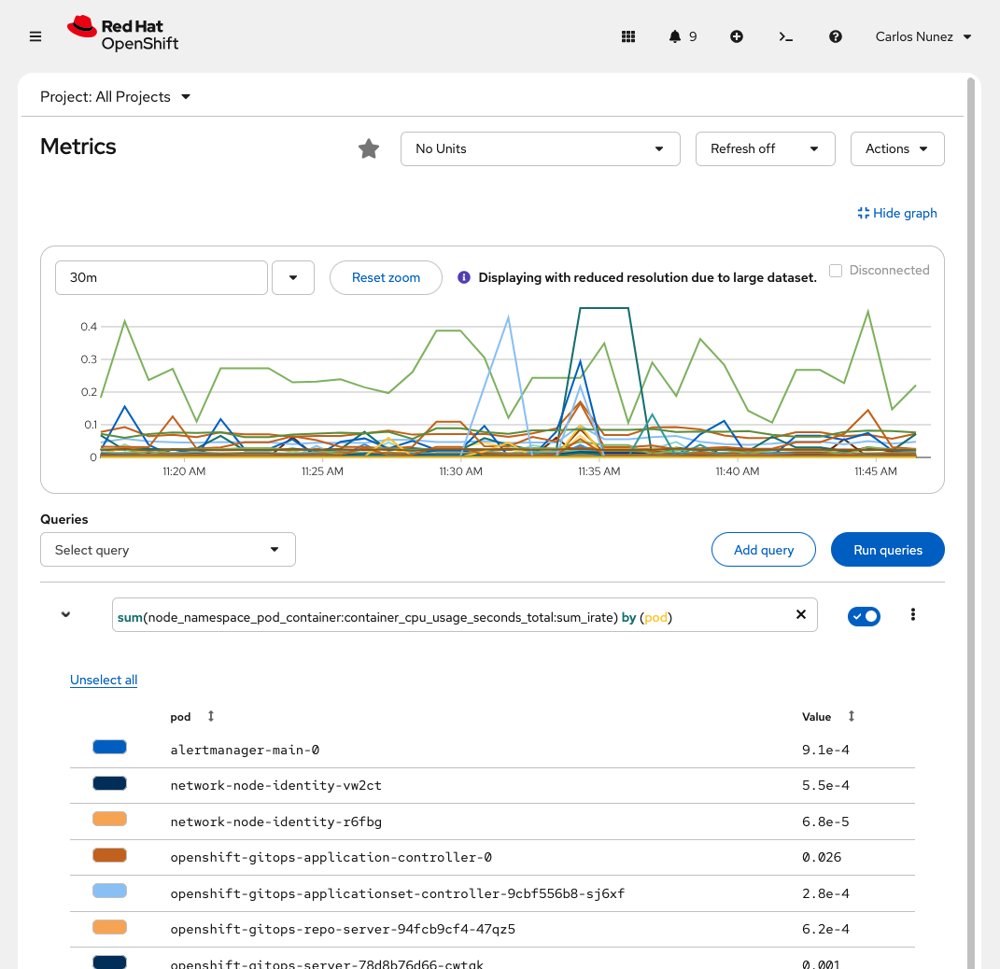

The built-in monitoring stack is based on Prometheus, so you can create custom
queries with PromQL. Let's say we wanted to see how much memory the ArgoCD
instance that the OpenShift GitOps operator deployed is consuming. We can do
this by changing the query shown here to
`sum(container_memory_working_set_bytes{pod=~".*gitops.*"}) by (pod)`.

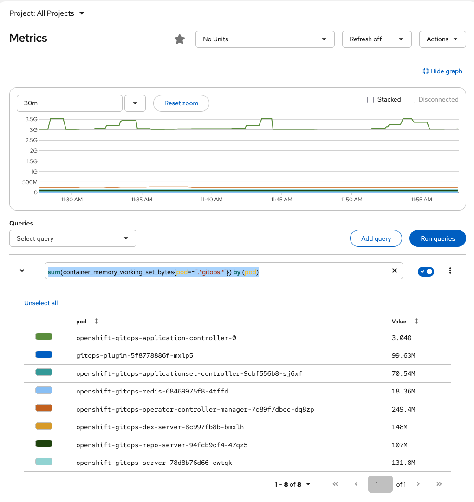

As we can see, our graph now changes to display memory consumption for our
ArgoCD application server instance.

### Zooming in with Signal Correlation and the Cluster Logging Operator

That the `application-server` Pod is consuming much more memory than the others
is interesting. Let's copy the Pod name, visit the **Pods** view and search for
it.

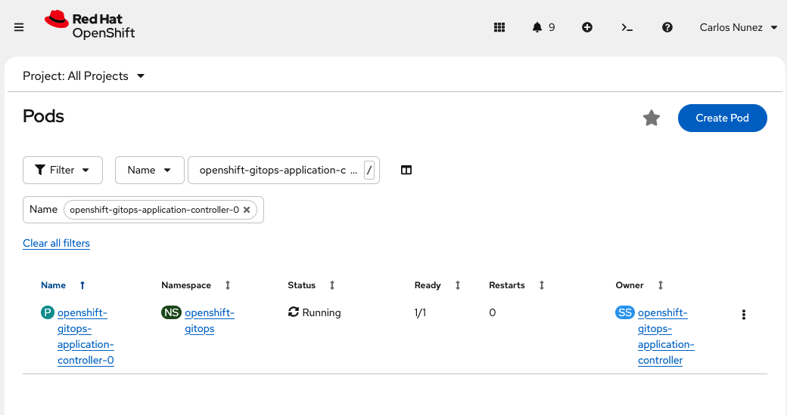

Let's visit the "Signal Correlation" view in the Console tiles to see who and
what's related to this Pod.

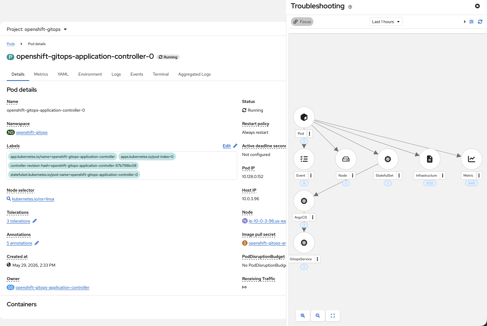

What we're looking at here is a map of all of the resources in our cluster that
are related to our GitOps Application Server. This is calculated by Korrel8r, an
open-source Kubernetes correlation engine that's included in the **Cluster
Observability Operator**.

From this graph, we can see that this Pod has many Infrastructure Kubernetes
logs related to it. When we click on that node, we're taken straight to the Logs View
in the OpenShift console to see all of the logs that pertain to this Pod. These
also include the logs that you'd see in the Pod view that we were in earlier.

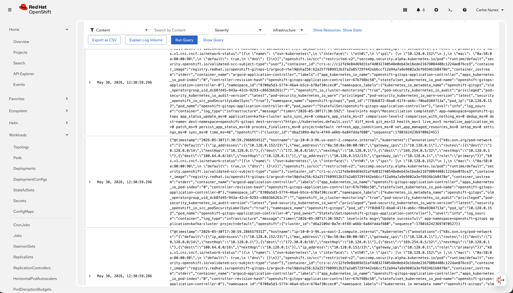

These logs are collected by an installation of Loki that's provided by the
**Cluster Logging Operator**. Very little configuration is needed to enable it.
Simply install the operator, create a `LokiStack` to stand up Loki and a
`ClusterLogForwarder` to forward cluster logs to it, and you're done. No complex
ConfigMaps required.

### Analyzing application behavior with OpenShift Tracing and OpenTelemetry

Let's revisit the **Observe** panel on the left here. We can see that it
contains a **Traces** section. This is useful for quickly analyzing
application-level platform from within the OpenShift console.

Let's have a look.

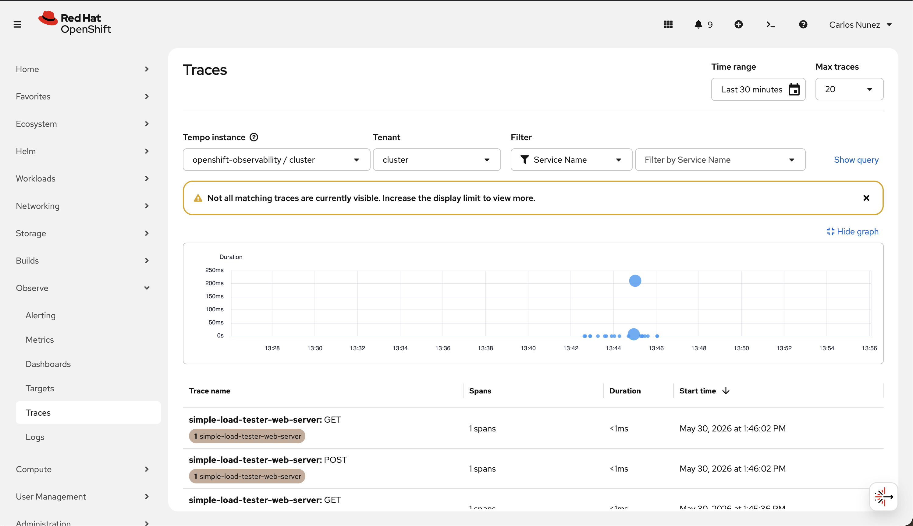

The Traces view gives us a dashboard of spans collected from applications in our
cluster. These are obtained by a collector process created by the **Red Hat
Build of OpenTelemetry** operator.

Application owners can configure their applications to send traces to the
collector in the clusters hosting their apps, like OpenShift GitOps is doing
here. This can also be done by an org- or enterprise-level tracing library that
automatically adds and configures the appropriate instrumentation.

OpenTelemetry can also automatically inject instrumentation to applications that
have not added it themselves, like the "simple-web-server" traces here
demonstrate.

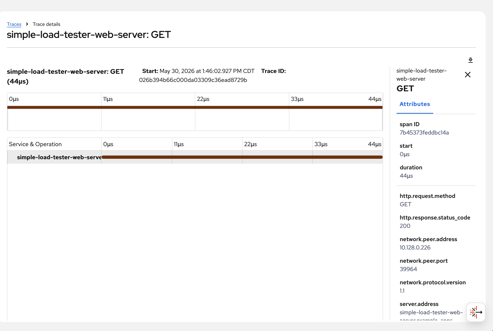

Let's see this span in more detail. Scrolling down on the left gives us the Pod
from which it originated. Let's take a look at it.

This is an example web application that I automatically generated with AI. I
used Source to Image to create an image and automatically spin up a Deployment
from it. The source for the application does not have tracing instrumentation
built into it, but, as you saw, OpenTelemetry was still able to surface traces
from it.

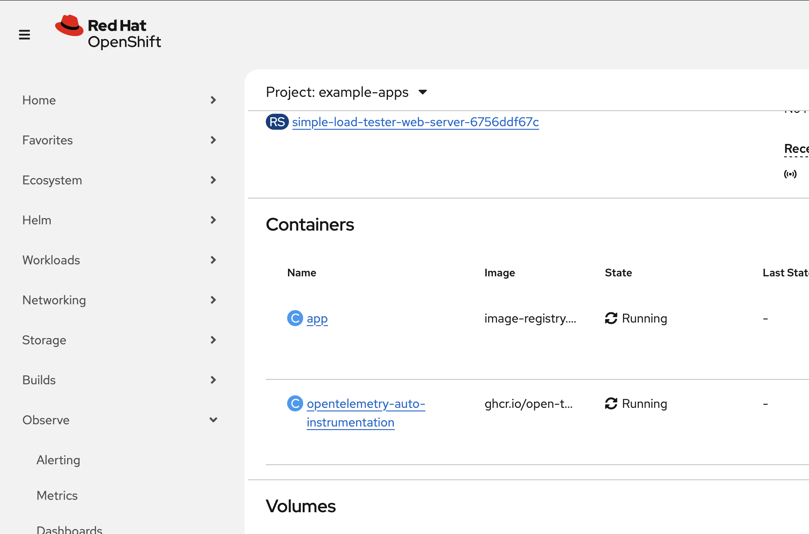

We can see a sidecar from OpenTelemetry here. This is using eBPF to analyze the
application running inside of the Pod and generate traces like the request time
we saw before. All I had to do to enable this was annotate the app, like we'll
see here.

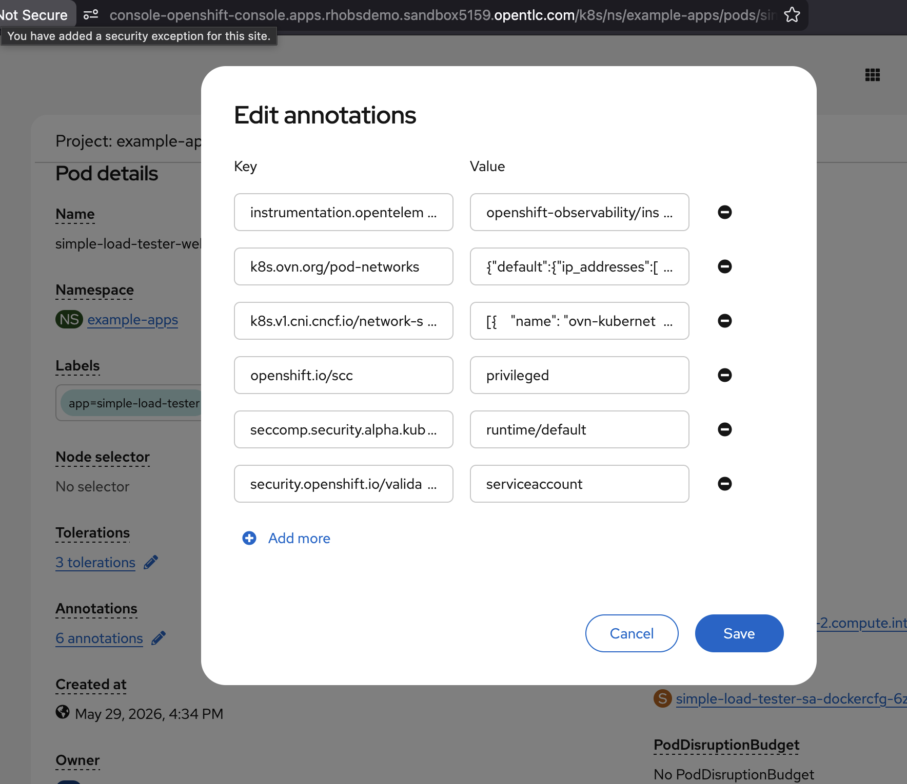

Here, we can see that there's an annotation called `inject-go` that's set to a
resource in the `openshift-observability` namespace. This is an
`Instrumentation` resource that handles automatically wiring up applications to
the OpenTelemetry collector we saw earlier.

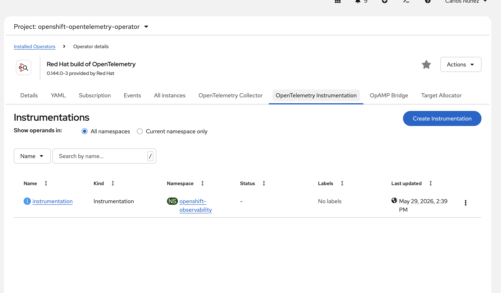

These `Instrumentation` resources and policies that automatically add these
annotations can be automatically provisioned by GitOps or ACM.

### Export into existing observability platforms

All of this is great for local observability. However, your org already has a
bunch of tools that centralize this stuff, and the engineers that you support
wlil more than likely use those for their alerts, triage and troubleshooting.

It is very easy to forward these signals to your existing tools. Let's go to our
Installed Operators to have a look.

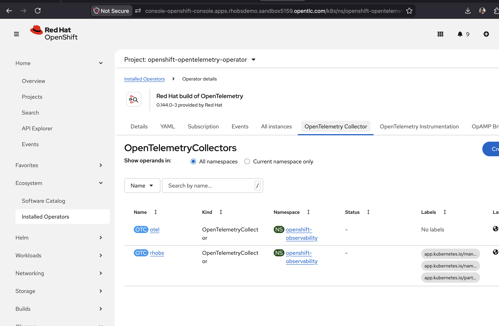

Narrowing this list down to our OpenTelemetry operator, we can find our
collectors by clicking on it then on the "OpenTelemetry Collector" tab in the
following page and clicking "YAML" to get more details about it.

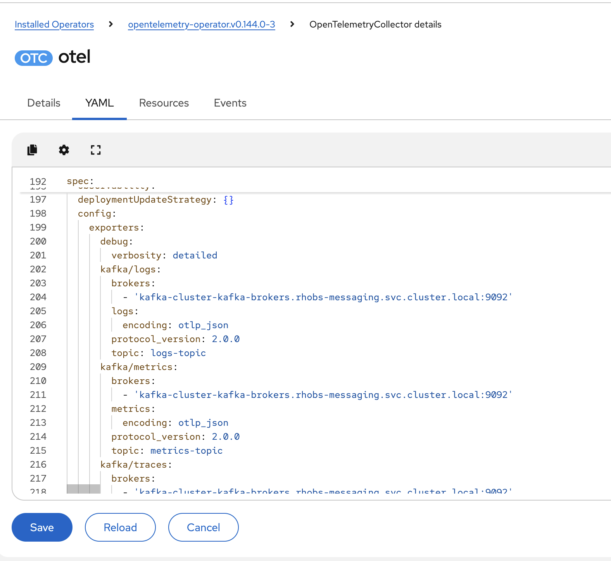

We can see that our OpenTelemetry Collector is sending metrics, logs and traces
to Kafka. Sending signals to Kafka is useful, as your downstream systems can
simply pull data from these topics like any other application. However,
OpenTelemetry can export data to anything that speaks the OpenTelemetry
Protocol, or OTLP, like Grafana, Perses or traditional ELK stacks.

In this demo, I'm using **Streams for Apache Kafka**, an operator that
simplifies creating Kafka clusters and topics within them. Let's visit the
Kafka Console from the tiles in the OpenShift Console to have a look at these
Kafka topics to see what that data looks like.


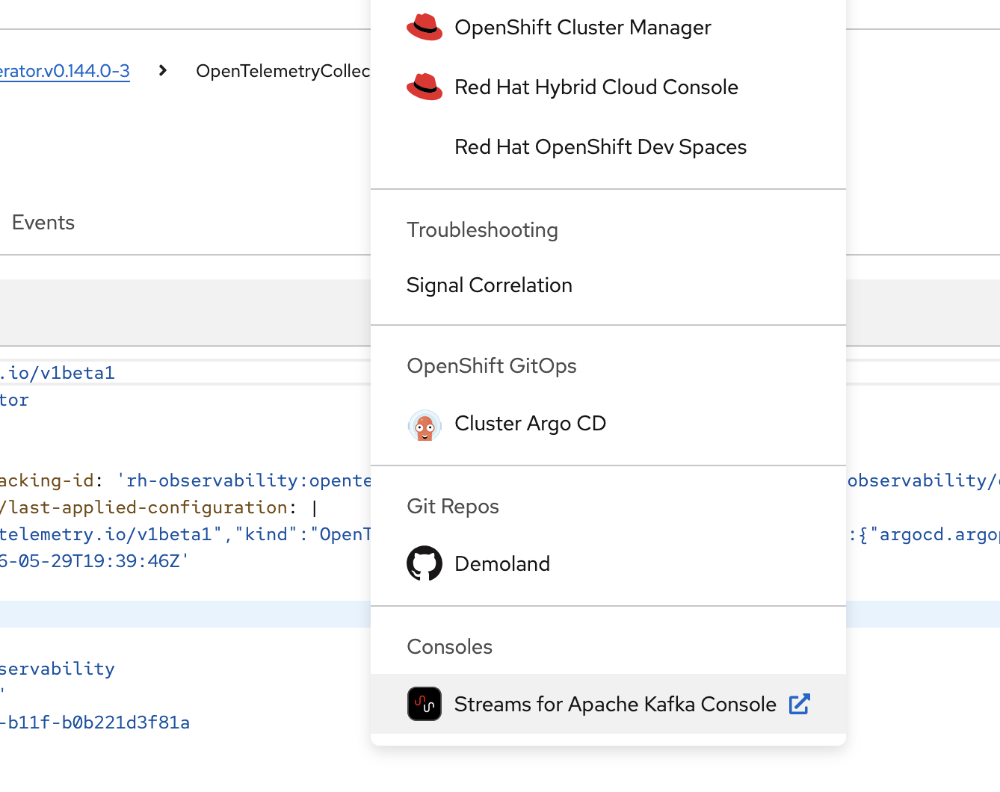

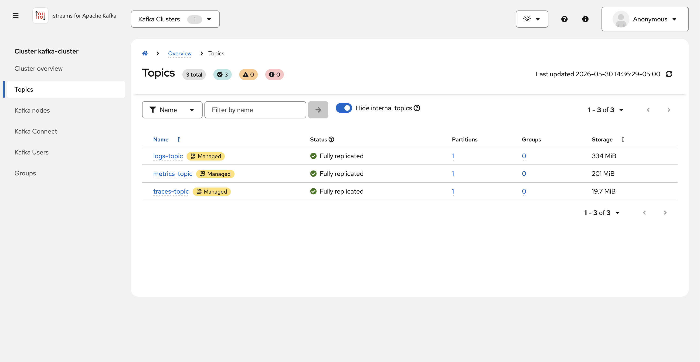

Upon clicking on Topics, we can see that we have a topic for each of the
observability pillars. If we click on any of them, we'll see lots of messages in
the topic containing OTLP-formatted JSON with information about the signal.
Since OTLP is a protocol, any software that speaks it can take this and use it
to enable you to perform further analysis, like dashboards and queries.

This is one way to enable multi-cluster observability as well. As long as every
cluster is configured with the exporter configuration we saw earlier, you'll be
able to use your existing tooling to slice and dice information from your
clusters during troubleshooting events.

### Next Steps

- **Multicluster Observability with ACM**: We saw how to use OpenShift cluster
  observability operators to surface and analyze traditional observability
  signals within the OpenShift Console as well as from external systems like
  Kafka. **Advanced Cluster Management for OpenShift (ACM)** is another great
  way to obtain multicluster observability as well as manage all of your
  OpenShift or Kubernetes clusters.

- **Observability at the speed of thought with OpenShift Lightspeed**: OpenShift
  Lightspeed is a great way to "chat with your cluster" to do almost anything,
  including understanding underlying behavior and probe into its workloads.
